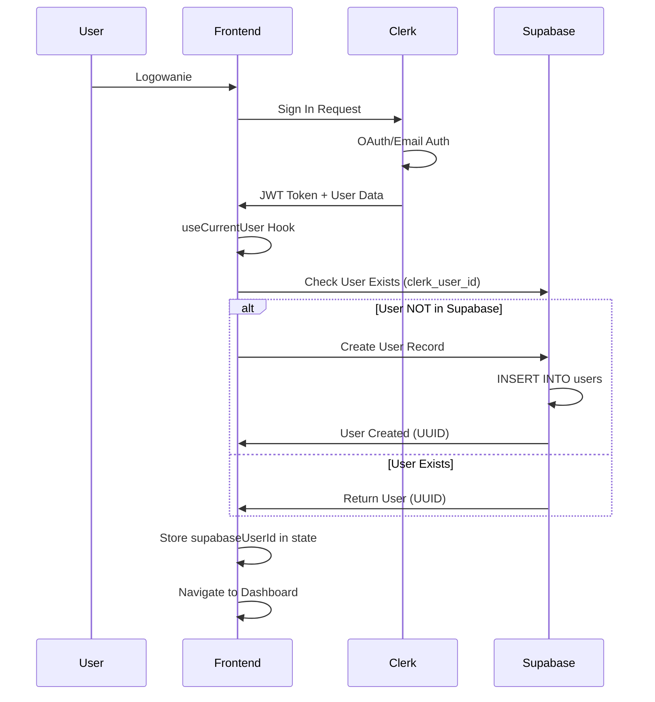
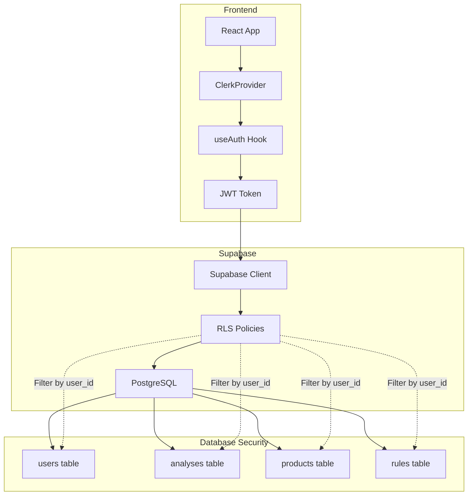
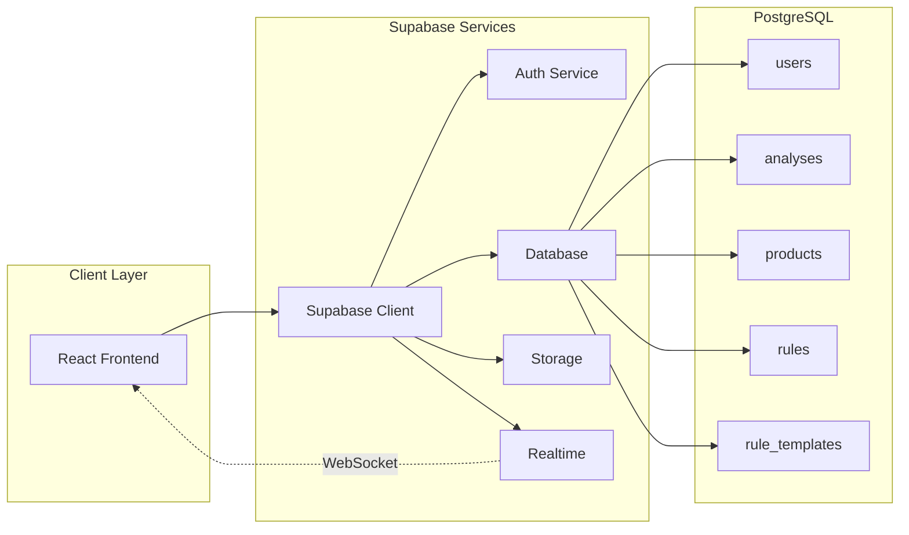
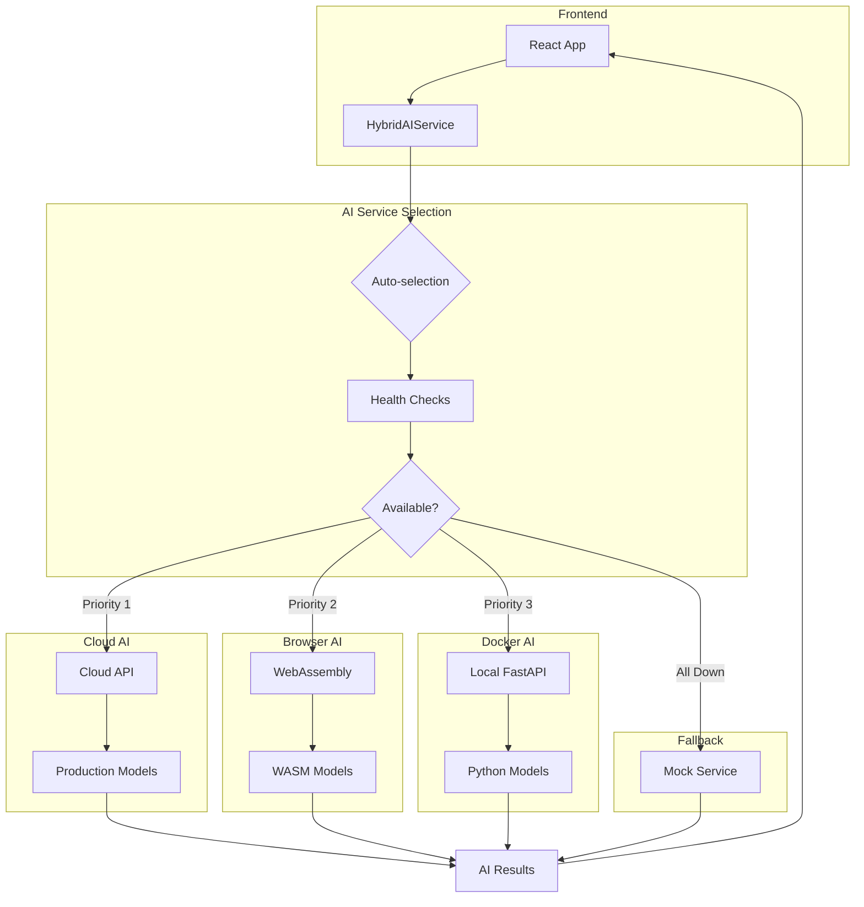
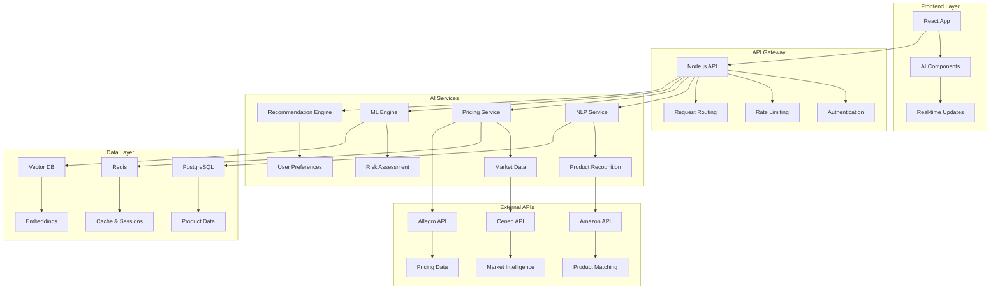
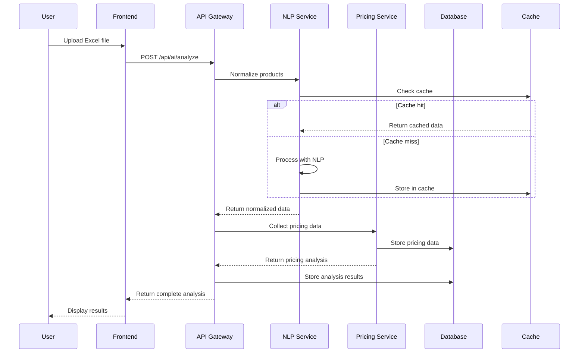

# 🏗️ **Technical Architecture - PalletAI**

## 📋 **Overview**

Architektura techniczna aplikacji Pallet Analysis obejmująca autentykację (Clerk), backend (Supabase), funkcjonalności AI oraz frontend (React). System zapewnia skalowalność, wydajność, bezpieczeństwo i niezawodność.

## 🔐 **Authentication & User Flow**

### **Clerk → Supabase Integration**



### **User Authentication Flow**

**1. Initial Load**
```typescript
// src/main.tsx
<ClerkProvider publishableKey={CLERK_KEY}>
  <App />
</ClerkProvider>
```

**2. Protected Route Check**
```typescript
// src/components/ProtectedRoute.tsx
const ProtectedRoute = ({ children }) => {
  const { isSignedIn, isLoaded } = useAuth()
  
  if (!isLoaded) return <Loading />
  if (!isSignedIn) return <Navigate to="/" />
  
  return children
}
```

**3. Supabase User Sync**
```typescript
// src/hooks/useCurrentUser.ts
export const useCurrentUser = () => {
  const { user } = useUser() // Clerk
  const [supabaseUserId, setSupabaseUserId] = useState<string>()
  
  useEffect(() => {
    if (user) {
      // Check if user exists in Supabase
      const supabaseUser = await clerkSupabaseService.getOrCreateUser(user)
      setSupabaseUserId(supabaseUser.id)
    }
  }, [user])
  
  return { supabaseUserId, clerkUserId: user?.id }
}
```

### **Security Model**



**RLS Policies Example**:
```sql
-- Users can only see their own data
CREATE POLICY "Users own data only" 
ON analyses FOR ALL 
USING (auth.uid() = user_id);

-- Automatically set user_id on insert
CREATE POLICY "Auto set user_id" 
ON analyses FOR INSERT 
WITH CHECK (auth.uid() = user_id);
```

## 💾 **Backend Architecture (Supabase)**

### **System Overview**



### **Database Schema**

```sql
-- Users table (synced from Clerk)
CREATE TABLE users (
  id UUID PRIMARY KEY DEFAULT uuid_generate_v4(),
  clerk_user_id TEXT UNIQUE NOT NULL,
  email TEXT NOT NULL,
  name TEXT,
  avatar_url TEXT,
  created_at TIMESTAMPTZ DEFAULT NOW(),
  updated_at TIMESTAMPTZ DEFAULT NOW()
);

-- Analyses table
CREATE TABLE analyses (
  id UUID PRIMARY KEY DEFAULT uuid_generate_v4(),
  user_id UUID REFERENCES users(id) ON DELETE CASCADE,
  name TEXT NOT NULL,
  file_name TEXT,
  file_url TEXT,
  status TEXT DEFAULT 'pending', -- pending, processing, completed, failed
  total_products INTEGER DEFAULT 0,
  products_ok INTEGER DEFAULT 0,
  products_warning INTEGER DEFAULT 0,
  products_blocked INTEGER DEFAULT 0,
  metadata JSONB,
  created_at TIMESTAMPTZ DEFAULT NOW(),
  updated_at TIMESTAMPTZ DEFAULT NOW()
);

-- Products table
CREATE TABLE products (
  id UUID PRIMARY KEY DEFAULT uuid_generate_v4(),
  analysis_id UUID REFERENCES analyses(id) ON DELETE CASCADE,
  user_id UUID REFERENCES users(id) ON DELETE CASCADE,
  
  -- Basic Info
  name TEXT NOT NULL,
  category TEXT,
  description TEXT,
  price DECIMAL(10,2),
  quantity INTEGER,
  unit TEXT,
  
  -- Identifiers
  ean TEXT,
  sku TEXT,
  brand TEXT,
  
  -- Pallet-specific
  paleta_id TEXT,
  foto TEXT,
  code1 TEXT,
  code2 TEXT,
  pack_id TEXT,
  fc_sku TEXT,
  link TEXT,
  currency TEXT DEFAULT 'PLN',
  price_gross DECIMAL(10,2),
  price_net DECIMAL(10,2),
  
  -- Evaluation
  score INTEGER DEFAULT 50,
  status TEXT DEFAULT 'pending', -- pending, ok, warning, blocked
  evaluation_data JSONB,
  
  -- Metadata
  source TEXT,
  row_index INTEGER,
  raw_data JSONB,
  
  created_at TIMESTAMPTZ DEFAULT NOW(),
  updated_at TIMESTAMPTZ DEFAULT NOW()
);

-- Rules table (per-user)
CREATE TABLE rules (
  id UUID PRIMARY KEY DEFAULT uuid_generate_v4(),
  user_id UUID REFERENCES users(id) ON DELETE CASCADE,
  name TEXT NOT NULL,
  description TEXT,
  type TEXT NOT NULL, -- category, product, budget, quality
  action TEXT NOT NULL, -- block, warn, prefer
  weight INTEGER DEFAULT 5,
  is_active BOOLEAN DEFAULT TRUE,
  conditions JSONB NOT NULL,
  created_at TIMESTAMPTZ DEFAULT NOW(),
  updated_at TIMESTAMPTZ DEFAULT NOW()
);

-- Rule templates (global, shared by all users)
CREATE TABLE rule_templates (
  id UUID PRIMARY KEY DEFAULT uuid_generate_v4(),
  name TEXT NOT NULL,
  description TEXT,
  type TEXT NOT NULL,
  action TEXT NOT NULL,
  weight INTEGER DEFAULT 5,
  conditions JSONB NOT NULL,
  is_global BOOLEAN DEFAULT TRUE,
  created_at TIMESTAMPTZ DEFAULT NOW()
);

-- Indexes for performance
CREATE INDEX idx_products_analysis_id ON products(analysis_id);
CREATE INDEX idx_products_user_id ON products(user_id);
CREATE INDEX idx_products_category ON products(category);
CREATE INDEX idx_products_status ON products(status);
CREATE INDEX idx_analyses_user_id ON analyses(user_id);
CREATE INDEX idx_rules_user_id ON rules(user_id);
```

### **Triggers & Functions**

```sql
-- Auto-update timestamps
CREATE OR REPLACE FUNCTION update_updated_at_column()
RETURNS TRIGGER AS $$
BEGIN
  NEW.updated_at = NOW();
  RETURN NEW;
END;
$$ language 'plpgsql';

CREATE TRIGGER update_users_updated_at 
  BEFORE UPDATE ON users 
  FOR EACH ROW EXECUTE FUNCTION update_updated_at_column();

CREATE TRIGGER update_analyses_updated_at 
  BEFORE UPDATE ON analyses 
  FOR EACH ROW EXECUTE FUNCTION update_updated_at_column();

-- Auto-update analysis statistics
CREATE OR REPLACE FUNCTION recalculate_analysis_stats()
RETURNS TRIGGER AS $$
BEGIN
  UPDATE analyses 
  SET 
    total_products = (SELECT COUNT(*) FROM products WHERE analysis_id = NEW.analysis_id),
    products_ok = (SELECT COUNT(*) FROM products WHERE analysis_id = NEW.analysis_id AND status = 'ok'),
    products_warning = (SELECT COUNT(*) FROM products WHERE analysis_id = NEW.analysis_id AND status = 'warning'),
    products_blocked = (SELECT COUNT(*) FROM products WHERE analysis_id = NEW.analysis_id AND status = 'blocked')
  WHERE id = NEW.analysis_id;
  
  RETURN NEW;
END;
$$ language 'plpgsql';

CREATE TRIGGER update_analysis_stats_on_product_change
  AFTER INSERT OR UPDATE OR DELETE ON products
  FOR EACH ROW EXECUTE FUNCTION recalculate_analysis_stats();
```

### **Row Level Security (RLS) Policies**

```sql
-- Enable RLS on all tables
ALTER TABLE users ENABLE ROW LEVEL SECURITY;
ALTER TABLE analyses ENABLE ROW LEVEL SECURITY;
ALTER TABLE products ENABLE ROW LEVEL SECURITY;
ALTER TABLE rules ENABLE ROW LEVEL SECURITY;

-- Users table policies
CREATE POLICY "Users can view own profile" ON users
  FOR SELECT USING (clerk_user_id = auth.jwt() ->> 'sub');

CREATE POLICY "Users can update own profile" ON users
  FOR UPDATE USING (clerk_user_id = auth.jwt() ->> 'sub');

-- Analyses table policies
CREATE POLICY "Users can view own analyses" ON analyses
  FOR SELECT USING (user_id IN (
    SELECT id FROM users WHERE clerk_user_id = auth.jwt() ->> 'sub'
  ));

CREATE POLICY "Users can create own analyses" ON analyses
  FOR INSERT WITH CHECK (user_id IN (
    SELECT id FROM users WHERE clerk_user_id = auth.jwt() ->> 'sub'
  ));

CREATE POLICY "Users can update own analyses" ON analyses
  FOR UPDATE USING (user_id IN (
    SELECT id FROM users WHERE clerk_user_id = auth.jwt() ->> 'sub'
  ));

CREATE POLICY "Users can delete own analyses" ON analyses
  FOR DELETE USING (user_id IN (
    SELECT id FROM users WHERE clerk_user_id = auth.jwt() ->> 'sub'
  ));

-- Products table policies (similar structure)
CREATE POLICY "Users can view own products" ON products
  FOR SELECT USING (user_id IN (
    SELECT id FROM users WHERE clerk_user_id = auth.jwt() ->> 'sub'
  ));

-- Rules table policies (similar structure)
CREATE POLICY "Users can manage own rules" ON rules
  FOR ALL USING (user_id IN (
    SELECT id FROM users WHERE clerk_user_id = auth.jwt() ->> 'sub'
  ));

-- Rule templates are global (everyone can read)
CREATE POLICY "Everyone can view rule templates" ON rule_templates
  FOR SELECT USING (is_global = TRUE);
```

### **Real-time Subscriptions**

```typescript
// src/stores/analysisStoreSupabase.ts
const subscribeToAnalyses = (userId: string) => {
  const subscription = supabase
    .channel('analyses-changes')
    .on(
      'postgres_changes',
      {
        event: '*', // INSERT, UPDATE, DELETE
        schema: 'public',
        table: 'analyses',
        filter: `user_id=eq.${userId}`
      },
      (payload) => {
        console.log('Analysis changed:', payload)
        // Update local state
        if (payload.eventType === 'INSERT') {
          set(state => ({ analyses: [...state.analyses, payload.new] }))
        } else if (payload.eventType === 'UPDATE') {
          set(state => ({
            analyses: state.analyses.map(a => 
              a.id === payload.new.id ? payload.new : a
            )
          }))
        } else if (payload.eventType === 'DELETE') {
          set(state => ({
            analyses: state.analyses.filter(a => a.id !== payload.old.id)
          }))
        }
      }
    )
    .subscribe()
  
  return subscription
}
```

## 🤖 **Hybrid AI Service Architecture**

### **Multi-modal AI System**



### **Service Implementation**

```typescript
// src/services/hybridAIService.ts
export class HybridAIService {
  private configs: AIServiceConfig[] = [
    {
      type: 'cloud',
      url: 'https://api.pallet-analysis.com/v1',
      priority: 1,
      enabled: false // Not yet available
    },
    {
      type: 'browser',
      priority: 2,
      enabled: true // WebAssembly (in development)
    },
    {
      type: 'docker',
      url: 'http://localhost:8000',
      priority: 3,
      enabled: true // Local development
    }
  ]
  
  async checkAllServices(): Promise<HybridAIStatus> {
    // Parallel health checks
    const [cloud, browser, docker] = await Promise.allSettled([
      this.checkCloudService(),
      this.checkBrowserService(),
      this.checkDockerService()
    ])
    
    // Auto-select best available
    this.autoSelectService()
    
    return {
      cloud: cloud.status === 'fulfilled' ? 'online' : 'offline',
      browser: browser.status === 'fulfilled' ? 'online' : 'offline',
      docker: docker.status === 'fulfilled' ? 'online' : 'offline',
      active: this.currentService,
      lastChecked: new Date().toISOString()
    }
  }
  
  async normalizeProduct(name: string): Promise<AIAnalysisResult> {
    // Try active service
    try {
      switch (this.currentService) {
        case 'cloud':
          return await this.cloudNormalizeProduct(name)
        case 'browser':
          return await this.browserNormalizeProduct(name)
        case 'docker':
          return await this.dockerNormalizeProduct(name)
      }
    } catch (error) {
      // Fallback to next service
      return await this.fallbackNormalizeProduct(name)
    }
  }
}
```

## 🏛️ **System Architecture**

### **High-Level Architecture**



## 🔧 **Technology Stack**

### **Backend Services**

#### **Main API Server (Node.js)**
```javascript
// Express.js with TypeScript
import express from 'express';
import { aiRouter } from './routes/ai';
import { authMiddleware } from './middleware/auth';
import { rateLimitMiddleware } from './middleware/rateLimit';

const app = express();

// AI Routes
app.use('/api/ai', authMiddleware, rateLimitMiddleware, aiRouter);

// Health check
app.get('/health', (req, res) => {
  res.json({ status: 'healthy', timestamp: new Date().toISOString() });
});
```

#### **AI Services (Python)**
```python
# FastAPI for AI services
from fastapi import FastAPI, BackgroundTasks
from ai_services.nlp_service import NLPService
from ai_services.pricing_service import PricingService
from ai_services.ml_engine import MLEngine

app = FastAPI(title="Pallet Analysis AI Services")

@app.post("/ai/normalize-product")
async def normalize_product(product_data: ProductData):
    nlp_service = NLPService()
    return await nlp_service.normalize_product(product_data)

@app.post("/ai/collect-pricing")
async def collect_pricing(product_id: str, background_tasks: BackgroundTasks):
    pricing_service = PricingService()
    background_tasks.add_task(pricing_service.collect_pricing_data, product_id)
    return {"status": "started", "product_id": product_id}
```

### **Database Schema**

#### **PostgreSQL - Main Database**
```sql
-- Products with AI features
CREATE TABLE products_ai (
    id UUID PRIMARY KEY DEFAULT gen_random_uuid(),
    original_name TEXT NOT NULL,
    normalized_name TEXT,
    brand VARCHAR(255),
    model VARCHAR(255),
    category VARCHAR(100),
    confidence_score DECIMAL(3,2),
    specifications JSONB,
    created_at TIMESTAMP DEFAULT NOW(),
    updated_at TIMESTAMP DEFAULT NOW()
);

-- Pricing data
CREATE TABLE pricing_data (
    id UUID PRIMARY KEY DEFAULT gen_random_uuid(),
    product_id UUID REFERENCES products_ai(id),
    source VARCHAR(50) NOT NULL, -- 'allegro', 'amazon', 'ceneo'
    price DECIMAL(10,2) NOT NULL,
    currency VARCHAR(3) DEFAULT 'PLN',
    date_collected TIMESTAMP DEFAULT NOW(),
    is_outlier BOOLEAN DEFAULT FALSE,
    metadata JSONB
);

-- User preferences for recommendations
CREATE TABLE user_preferences (
    id UUID PRIMARY KEY DEFAULT gen_random_uuid(),
    user_id UUID NOT NULL,
    category_preferences JSONB,
    purchase_patterns JSONB,
    ml_model_data JSONB,
    created_at TIMESTAMP DEFAULT NOW(),
    updated_at TIMESTAMP DEFAULT NOW()
);

-- Risk assessments
CREATE TABLE risk_assessments (
    id UUID PRIMARY KEY DEFAULT gen_random_uuid(),
    product_id UUID REFERENCES products_ai(id),
    risk_score DECIMAL(3,2),
    risk_factors JSONB,
    predictions JSONB,
    created_at TIMESTAMP DEFAULT NOW()
);

-- AI processing queue
CREATE TABLE ai_processing_queue (
    id UUID PRIMARY KEY DEFAULT gen_random_uuid(),
    task_type VARCHAR(50) NOT NULL, -- 'normalize', 'pricing', 'risk'
    payload JSONB NOT NULL,
    status VARCHAR(20) DEFAULT 'pending',
    priority INTEGER DEFAULT 0,
    created_at TIMESTAMP DEFAULT NOW(),
    processed_at TIMESTAMP,
    error_message TEXT
);

-- Indexes for performance
CREATE INDEX idx_products_ai_category ON products_ai(category);
CREATE INDEX idx_products_ai_confidence ON products_ai(confidence_score);
CREATE INDEX idx_pricing_data_product_id ON pricing_data(product_id);
CREATE INDEX idx_pricing_data_source ON pricing_data(source);
CREATE INDEX idx_ai_queue_status ON ai_processing_queue(status);
```

#### **Redis - Cache & Sessions**
```redis
# Product analysis cache
SETEX product_analysis:{product_id} 3600 "{analysis_data}"

# Pricing data cache
SETEX pricing:{product_id} 1800 "{pricing_data}"

# User session data
HSET user_session:{user_id} preferences "{user_preferences}"

# Rate limiting
INCR rate_limit:{user_id}:{endpoint}
EXPIRE rate_limit:{user_id}:{endpoint} 3600
```

### **AI/ML Infrastructure**

#### **NLP Service Architecture**
```python
class NLPService:
    def __init__(self):
        self.nlp_model = spacy.load("pl_core_news_sm")
        self.category_classifier = self.load_category_classifier()
        self.brand_recognizer = BrandRecognizer()
        self.redis_client = redis.Redis(host='redis', port=6379, db=0)
    
    async def normalize_product(self, product_data: ProductData) -> NormalizedProduct:
        # Check cache first
        cache_key = f"normalized:{hash(product_data.name)}"
        cached = self.redis_client.get(cache_key)
        if cached:
            return NormalizedProduct.parse_raw(cached)
        
        # Process with NLP
        doc = self.nlp_model(product_data.name)
        
        # Extract information
        brand = self.brand_recognizer.extract_brand(doc)
        category = self.category_classifier.predict(doc)
        specifications = self.extract_specifications(doc)
        
        result = NormalizedProduct(
            original_name=product_data.name,
            normalized_name=self.clean_name(product_data.name),
            brand=brand,
            category=category,
            specifications=specifications,
            confidence=self.calculate_confidence(doc)
        )
        
        # Cache result
        self.redis_client.setex(cache_key, 3600, result.json())
        
        return result
```

#### **Pricing Service Architecture**
```python
class PricingService:
    def __init__(self):
        self.allegro_scraper = AllegroScraper()
        self.amazon_api = AmazonAPI()
        self.ceneo_api = CeneoAPI()
        self.price_analyzer = PriceAnalyzer()
        self.db_client = DatabaseClient()
    
    async def collect_pricing_data(self, product_id: str) -> PricingData:
        # Get product info
        product = await self.db_client.get_product(product_id)
        
        # Collect from multiple sources in parallel
        tasks = [
            self.allegro_scraper.get_prices(product),
            self.amazon_api.get_prices(product),
            self.ceneo_api.get_prices(product)
        ]
        
        results = await asyncio.gather(*tasks, return_exceptions=True)
        
        # Process results
        all_prices = []
        for result in results:
            if isinstance(result, list):
                all_prices.extend(result)
        
        # Analyze prices
        price_analysis = self.price_analyzer.analyze(all_prices)
        
        # Store in database
        await self.db_client.store_pricing_data(product_id, price_analysis)
        
        return price_analysis
```

## 🔄 **Data Flow Architecture**

### **Real-time Processing Pipeline**



### **Background Processing Queue**

```python
# Celery for background tasks
from celery import Celery
from ai_services.pricing_service import PricingService
from ai_services.risk_engine import RiskEngine

app = Celery('pallet_analysis_ai')

@app.task
def collect_pricing_data_async(product_id: str):
    pricing_service = PricingService()
    return pricing_service.collect_pricing_data(product_id)

@app.task
def assess_risk_async(product_id: str):
    risk_engine = RiskEngine()
    return risk_engine.assess_risk(product_id)

@app.task
def update_recommendations_async(user_id: str):
    recommendation_engine = RecommendationEngine()
    return recommendation_engine.update_recommendations(user_id)
```

## 🚀 **Deployment Architecture**

### **Docker Configuration**

#### **Main API (Node.js)**
```dockerfile
FROM node:18-alpine

WORKDIR /app
COPY package*.json ./
RUN npm ci --only=production

COPY . .
RUN npm run build

EXPOSE 3000
CMD ["npm", "start"]
```

#### **AI Services (Python)**
```dockerfile
FROM python:3.9-slim

WORKDIR /app
COPY requirements.txt .
RUN pip install -r requirements.txt

COPY . .
RUN python -m spacy download pl_core_news_sm

EXPOSE 8000
CMD ["uvicorn", "main:app", "--host", "0.0.0.0", "--port", "8000"]
```

#### **Docker Compose**
```yaml
version: '3.8'

services:
  # Main API
  api:
    build: ./api
    ports:
      - "3000:3000"
    environment:
      - DATABASE_URL=postgresql://user:pass@db:5432/pallet_analysis
      - REDIS_URL=redis://redis:6379
    depends_on:
      - db
      - redis

  # AI Services
  ai-services:
    build: ./ai-services
    ports:
      - "8000:8000"
    environment:
      - DATABASE_URL=postgresql://user:pass@db:5432/pallet_analysis
      - REDIS_URL=redis://redis:6379
    depends_on:
      - db
      - redis

  # Database
  db:
    image: postgres:14
    environment:
      - POSTGRES_DB=pallet_analysis
      - POSTGRES_USER=user
      - POSTGRES_PASSWORD=pass
    volumes:
      - postgres_data:/var/lib/postgresql/data

  # Cache
  redis:
    image: redis:7-alpine
    volumes:
      - redis_data:/data

  # Message Queue
  celery:
    build: ./ai-services
    command: celery -A tasks worker --loglevel=info
    depends_on:
      - db
      - redis

volumes:
  postgres_data:
  redis_data:
```

### **Kubernetes Deployment**

```yaml
# api-deployment.yaml
apiVersion: apps/v1
kind: Deployment
metadata:
  name: pallet-analysis-api
spec:
  replicas: 3
  selector:
    matchLabels:
      app: pallet-analysis-api
  template:
    metadata:
      labels:
        app: pallet-analysis-api
    spec:
      containers:
      - name: api
        image: pallet-analysis/api:latest
        ports:
        - containerPort: 3000
        env:
        - name: DATABASE_URL
          valueFrom:
            secretKeyRef:
              name: db-secret
              key: url
        resources:
          requests:
            memory: "256Mi"
            cpu: "250m"
          limits:
            memory: "512Mi"
            cpu: "500m"
---
apiVersion: v1
kind: Service
metadata:
  name: pallet-analysis-api-service
spec:
  selector:
    app: pallet-analysis-api
  ports:
  - port: 80
    targetPort: 3000
  type: LoadBalancer
```

## 📊 **Monitoring & Observability**

### **Metrics Collection**

```python
# Prometheus metrics
from prometheus_client import Counter, Histogram, Gauge

# API metrics
api_requests_total = Counter('api_requests_total', 'Total API requests', ['method', 'endpoint', 'status'])
api_request_duration = Histogram('api_request_duration_seconds', 'API request duration')

# AI service metrics
ai_processing_duration = Histogram('ai_processing_duration_seconds', 'AI processing duration', ['service', 'operation'])
ai_model_accuracy = Gauge('ai_model_accuracy', 'AI model accuracy', ['model_name'])
pricing_data_coverage = Gauge('pricing_data_coverage', 'Pricing data coverage percentage')

# Database metrics
db_connections = Gauge('db_connections_active', 'Active database connections')
cache_hit_rate = Gauge('cache_hit_rate', 'Cache hit rate percentage')
```

### **Logging Configuration**

```python
import logging
import structlog

# Structured logging
structlog.configure(
    processors=[
        structlog.stdlib.filter_by_level,
        structlog.stdlib.add_logger_name,
        structlog.stdlib.add_log_level,
        structlog.stdlib.PositionalArgumentsFormatter(),
        structlog.processors.TimeStamper(fmt="iso"),
        structlog.processors.StackInfoRenderer(),
        structlog.processors.format_exc_info,
        structlog.processors.UnicodeDecoder(),
        structlog.processors.JSONRenderer()
    ],
    context_class=dict,
    logger_factory=structlog.stdlib.LoggerFactory(),
    wrapper_class=structlog.stdlib.BoundLogger,
    cache_logger_on_first_use=True,
)

logger = structlog.get_logger()
```

## 🔒 **Security Architecture**

### **Authentication & Authorization**

```typescript
// JWT-based authentication
import jwt from 'jsonwebtoken';
import { Request, Response, NextFunction } from 'express';

interface AuthRequest extends Request {
  user?: {
    id: string;
    email: string;
    role: string;
  };
}

export const authMiddleware = async (req: AuthRequest, res: Response, next: NextFunction) => {
  try {
    const token = req.headers.authorization?.split(' ')[1];
    
    if (!token) {
      return res.status(401).json({ error: 'No token provided' });
    }
    
    const decoded = jwt.verify(token, process.env.JWT_SECRET!) as any;
    req.user = decoded;
    
    next();
  } catch (error) {
    return res.status(401).json({ error: 'Invalid token' });
  }
};

// Role-based access control
export const requireRole = (role: string) => {
  return (req: AuthRequest, res: Response, next: NextFunction) => {
    if (req.user?.role !== role) {
      return res.status(403).json({ error: 'Insufficient permissions' });
    }
    next();
  };
};
```

### **API Security**

```typescript
// Rate limiting
import rateLimit from 'express-rate-limit';

export const rateLimitMiddleware = rateLimit({
  windowMs: 15 * 60 * 1000, // 15 minutes
  max: 100, // limit each IP to 100 requests per windowMs
  message: 'Too many requests from this IP, please try again later.',
  standardHeaders: true,
  legacyHeaders: false,
});

// Input validation
import Joi from 'joi';

export const validateProductData = (req: Request, res: Response, next: NextFunction) => {
  const schema = Joi.object({
    name: Joi.string().required().max(500),
    description: Joi.string().max(2000),
    price: Joi.number().positive(),
  });
  
  const { error } = schema.validate(req.body);
  if (error) {
    return res.status(400).json({ error: error.details[0].message });
  }
  
  next();
};
```

## 🚀 **Performance Optimization**

### **Caching Strategy**

```python
# Multi-level caching
class CacheManager:
    def __init__(self):
        self.redis_client = redis.Redis(host='redis', port=6379, db=0)
        self.local_cache = {}
    
    async def get(self, key: str):
        # Level 1: Local cache
        if key in self.local_cache:
            return self.local_cache[key]
        
        # Level 2: Redis cache
        cached = self.redis_client.get(key)
        if cached:
            data = json.loads(cached)
            self.local_cache[key] = data
            return data
        
        return None
    
    async def set(self, key: str, value: any, ttl: int = 3600):
        # Store in both caches
        self.local_cache[key] = value
        self.redis_client.setex(key, ttl, json.dumps(value))
```

### **Database Optimization**

```sql
-- Query optimization
EXPLAIN ANALYZE SELECT 
    p.normalized_name,
    AVG(pr.price) as avg_price,
    COUNT(pr.id) as price_count
FROM products_ai p
LEFT JOIN pricing_data pr ON p.id = pr.product_id
WHERE p.category = 'ELECTRONICS'
    AND pr.date_collected > NOW() - INTERVAL '30 days'
GROUP BY p.id, p.normalized_name
HAVING COUNT(pr.id) >= 3
ORDER BY avg_price DESC
LIMIT 100;

-- Connection pooling
-- In application code
const pool = new Pool({
  user: 'user',
  host: 'localhost',
  database: 'pallet_analysis',
  password: 'password',
  port: 5432,
  max: 20, // maximum number of clients in the pool
  idleTimeoutMillis: 30000, // close idle clients after 30 seconds
  connectionTimeoutMillis: 2000, // return an error after 2 seconds if connection could not be established
});
```

---

**Status**: Architecture ready for implementation
**Version**: 1.0
**Last Updated**: January 2025
**Next Review**: After Phase 1.1 completion

